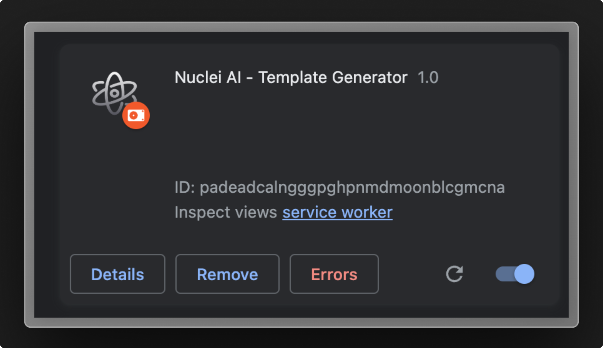
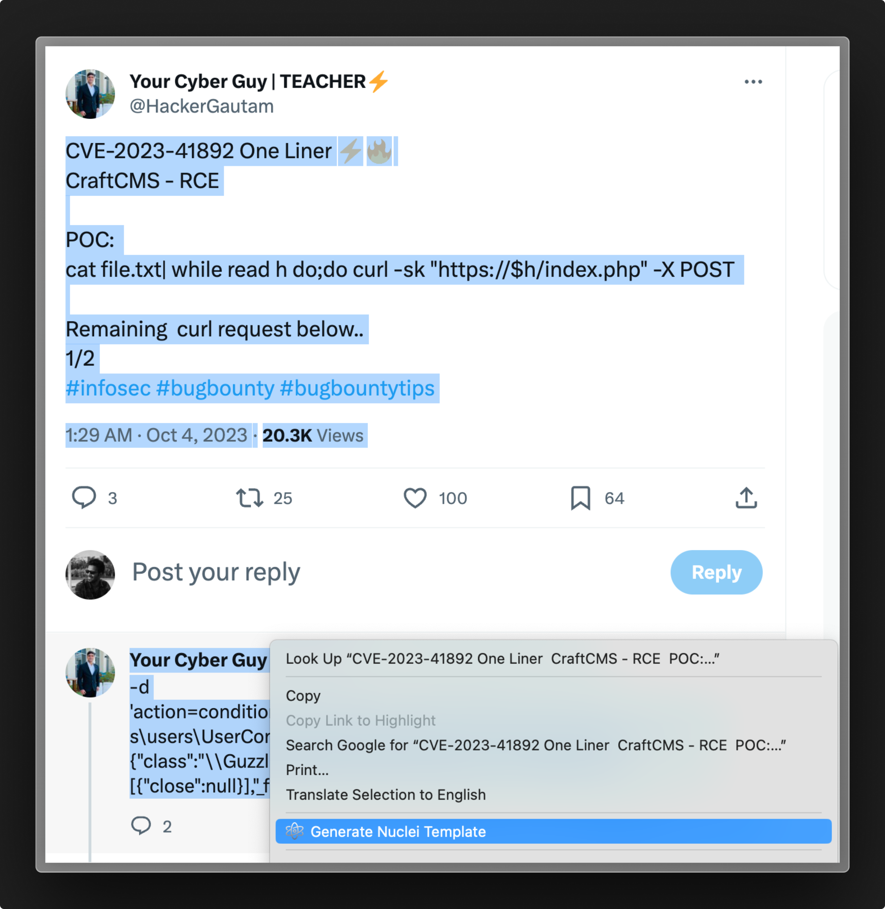
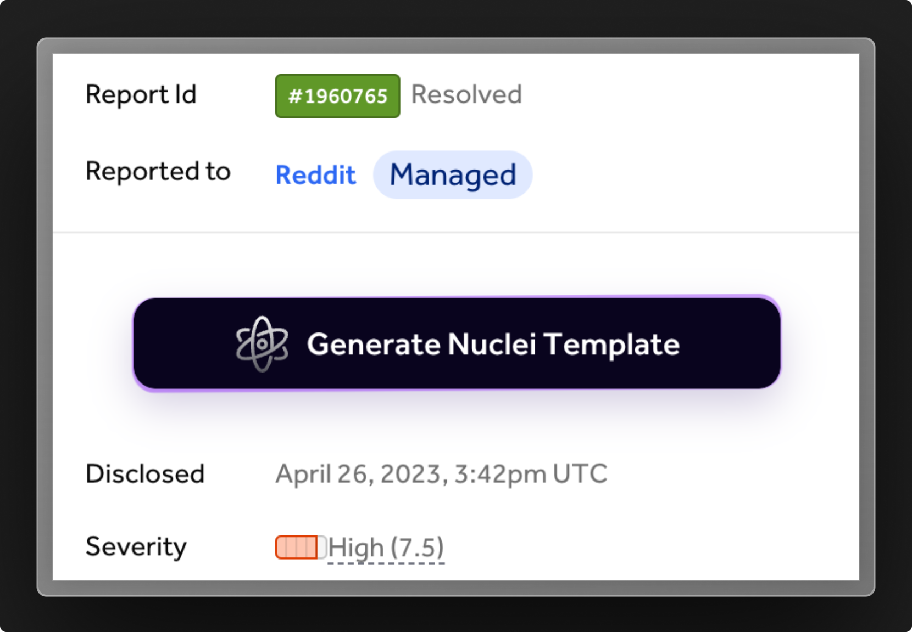

# Nuclei AI - Browser Extension

Nuclei AI Browser Extension, built on top of [cloud.projectdiscovery.io](https://cloud.projectdiscovery.io/templates), simplifies the creation of vulnerability templates, by enabling users to extract vulnerability information from any webpages to quickly and efficiently create nuclei templates, saving valuable time and effort.

## Prerequisite

A logged-in account on [cloud.projectdiscovery.io](https://cloud.projectdiscovery.io) is required to use this extension. You can sign up or log in before using Nuclei AI's features.

## Features

- **Context Menu Option to Generate Template**
- **HackerOne Report to Nuclei Template Generation**
- **ExploitDB exploit to Nuclei Template Generation**
- **BugCrowd / Intigriti / Synack support** (Coming soon) 

## Installation

### Manual Install

To manually install the Nuclei AI Browser Extension, follow these steps:

1. Download the [zipped extension file](https://github.com/projectdiscovery/nuclei-ai-extension/archive/refs/heads/main.zip) and unzip it.
2. Open your Chrome browser and navigate to `chrome://extensions`.
3. Enable the `Developer mode` toggle located in the top right corner of the page.
4. Click on `Load unpacked` and select the unzipped extension folder.

After following these steps, the Nuclei AI Browser Extension will be successfully installed in your Chrome browser.

### Chrome Web Store

Download and install the extension from the official extension store (coming-soon).

## Usage

### Any Webpage:

To generate nuclei templates from selected text on any website using the context menu:

1. **Select** the vulnerability information from any website, blog, or tweet.
2. Right-click to open the context menu and select the **Generate nuclei template** option.
3. If needed, make any changes to improve or update the prompt.
4. Click on the **Generate** button.
5. The AI will generate a Nuclei Template based on the selected text.

By following these steps, you can easily generate Nuclei Templates from any webpage with selected text.

### HackerOne Report:

To generate nuclei templates on HackerOne platform:

1. Open a publicly disclosed or any HackerOne report that you have access to. 
2. For example, open https://hackerone.com/reports/1960765
3. On the right sidebar, click on the Generate Nuclei Template button.
4. If needed, make any changes to improve or update the prompt.
5. Click on the Generate button.
6. A Nuclei Template will be generated based on the selected report.
7. You can validate or test the generated Nuclei Template right away.

### Keyboard Shortcut:

**Toggle AI Editor**:
- Press **CLT+SHIFT+O** on any webpage to toggle (open / hide) the AI Editor window.

### Notes
- All the templates generated with the extension will be automatically saved and stored in the user's projectdiscovery account.
- Please note that this is an early version, and not all exploits can be converted into templates depending on the available vulnerability information and features provided by [Nuclei](http://github.com/projectdiscovery/nuclei).

## Support

File issues or provide feedback via our [GitHub issue tracker](#).

## License

Licensed under the MIT License. See [LICENSE.md](./LICENSE.md) for more details.
